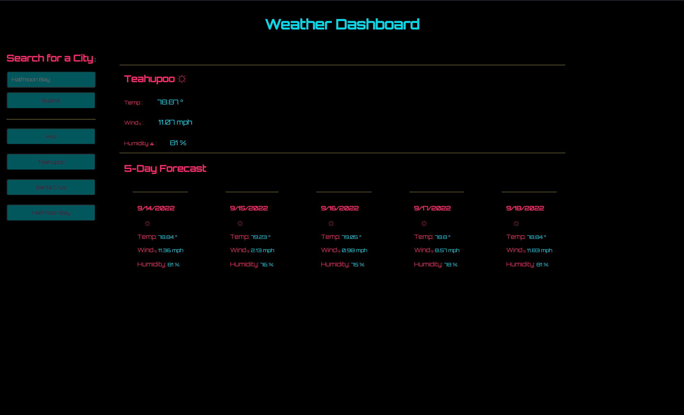

# Cyber Weather

## Description
Cyber Weather is a dynamic weather app with a cyberpunk aesthetic. The app allows users to search for and view live weather data, including a 5-day forecast, in an easy-to-read, minimal format. With a sleek design and focused data presentation, this app is ideal for users who want quick, relevant weather information without feeling overwhelmed.

### Motivations
The goal of this project was to deepen my understanding of front-end web development by integrating HTML, CSS, JavaScript, and external APIs. This project allowed me to hone my ability to work with APIs and gain practical experience in creating responsive, interactive web applications.

### Issues it Resolves
Many weather websites overwhelm users with too much information. This app solves that problem by providing just the essential weather data—current conditions and a 5-day forecast—presented in a streamlined, visually engaging way. 

### Technologies Used:
- HTML
- CSS
- JavaScript
- OpenWeather API

This project helped me refine my skills in JavaScript and API usage while improving my ability to style webpages responsively.

## Usage

### Cyber Weather Website:

To use this website:
1. Enter a city name into the search bar below the "Search for a City" header.
2. Click the "Submit" button or press "Enter" on your keyboard.
3. The current weather and 5-day forecast will appear below the "Weather Dashboard" header.
4. Previously searched cities will be displayed as clickable, responsive buttons beneath the "Submit" button. Clicking on a button will re-display the weather data for that city.

## Credits
This project was supported by Bobbi Turkany, an educator from the ASU web development program, whose guidance helped me deepen my understanding of front-end web development and JavaScript.

## Deployed Links
GitHub Weather Application Repo Link: [https://github.com/TrevorsDev/Cyber-Weather](https://github.com/TrevorsDev/Cyber-Weather)
